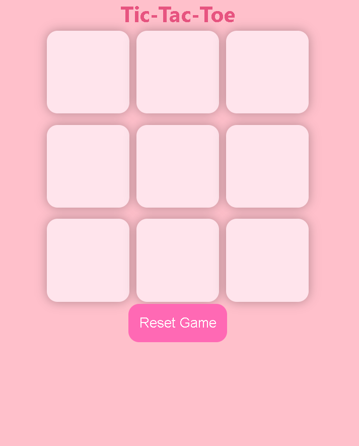

# Tic Tac Toe 🎮

A simple Tic Tac Toe game built with **HTML, CSS, and JavaScript**.

## How to Play
- Click on a box to place your mark (O or X).  
- The first player to get 3 in a row (horizontally, vertically, or diagonally) wins.  
- If all boxes are filled and no one wins, the game is a draw.  
- Click **Reset Game** or **New Game** to start over.

## Live Demo
Play the game online here:  
[Play Tic Tac Toe](https://nehakonakalla9.github.io/Tic-Tac-Toe/)

## Screenshot

## Built With
- HTML  
- CSS  
- JavaScript
